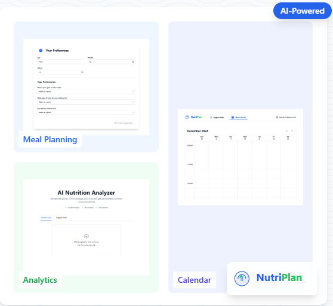

# NutriPlan - AI-Powered Meal Planning Platform

NutriPlan is a modern web application that combines AI technology with nutritional science to provide personalized meal planning and nutrition tracking solutions.

## Features

### 🤖 AI-Powered Meal Planning
Our advanced AI system analyzes your personal preferences, dietary restrictions, and nutritional goals to create customized meal plans. The system learns from your feedback to continuously improve recommendations.

- **Personalized Meal Suggestions**: The AI engine considers your taste preferences, cooking skill level, available time, and dietary needs to suggest meals that you'll actually enjoy making and eating
- **Dietary Restriction Support**: Comprehensive filtering for allergies, intolerances, and dietary preferences including vegetarian, vegan, gluten-free, dairy-free, keto, paleo and more
- **Smart Nutritional Optimization**: Meal plans are automatically balanced to meet your macro and micronutrient targets while staying within your calorie goals
- **Intelligent Recipe Recommendations**: Machine learning algorithms analyze your meal ratings and preferences to suggest new recipes you're likely to enjoy

### 📅 Smart Calendar Integration
Our intuitive calendar system makes it easy to plan and track your meals while building sustainable healthy eating habits.

- **Visual Meal Planning Interface**: Drag-and-drop interface for easily scheduling meals across breakfast, lunch, dinner and snacks
- **Portion Control Tools**: Built-in portion size calculator and measurement converter to help you serve the right amounts
- **Customizable Meal Routines**: Create and save meal templates for different scenarios like workdays, weekends, or special occasions
- **Flexible Planning Options**: Plan meals by day, week or month with easy copying and rescheduling of meals

### 📊 Nutrition Analytics
Comprehensive nutrition tracking and analysis tools help you understand your diet and make informed decisions.

- **Detailed Nutrient Tracking**: Automatically calculate and track over 30 nutrients including calories, protein, carbs, fats, vitamins and minerals
- **Smart Macro Monitoring**: Visual breakdowns of your macro ratios with recommendations to optimize your intake
- **Progress Visualization**: Interactive charts and graphs showing your nutrition trends over time
- **AI-Powered Insights**: Get personalized recommendations and alerts about your nutrition patterns and areas for improvement

The platform leverages advanced AI technology to provide a personalized nutrition experience, helping users make informed decisions about their diet while making meal planning effortless and enjoyable.